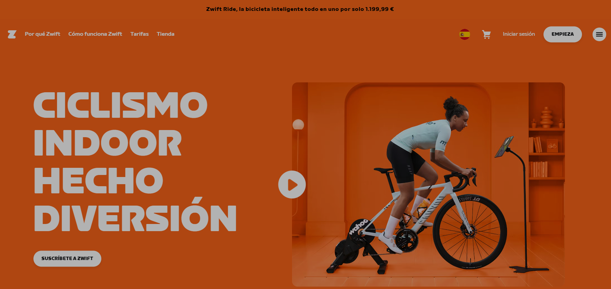
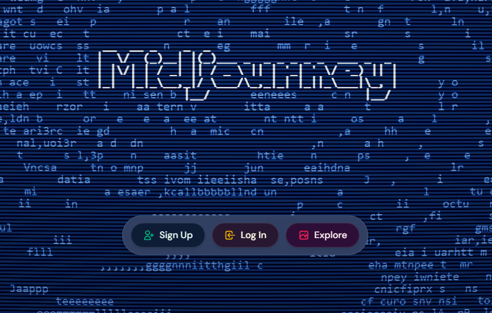

# PEC3: Manovich Reloaded
**Asignatura:** Cultura Digital  
**Autor:** Iván Jurado Seco  
**Fecha:** Mayo 2026

---

## 1. Introducción

En su obra <em>El software toma el mando</em>, Lev Manovich nos explica que el software no es solo una herramienta, sino la capa invisible que dirige nuestra cultura. Si Manovich tuviera que actualizar sus tesis hoy, se encontraría con un escenario donde la hibridación ha dado un salto gigante: ya no solo mezclamos fotos y texto en una web, sino que mezclamos nuestro esfuerzo físico real con mundos virtuales, o nuestra imaginación verbal con algoritmos de creación visual. En este ensayo analizo dos casos que son puro ADN de la hibridación moderna: <strong>Zwift</strong> y <strong>Midjourney</strong>.

---

## 2. Caso de estudio 1: Zwift (La hibridación del esfuerzo físico)

### Descripción e hibridación

Zwift es un caso fascinante de lo que Manovich llamaría un "metamedio". A simple vista parece un videojuego de ciclismo, pero técnicamente es una hibridación compleja de tres mundos: la <strong>cartografía digital</strong>, el <strong>multijugador masivo (MMO)</strong> y la <strong>simulación física</strong>. El usuario no juega con un mando, sino con su propio cuerpo montado en una bicicleta real sobre un rodillo inteligente que se comunica con el software mediante protocolos como ANT+ o Bluetooth.

  

Aquí la hibridación ocurre en el flujo de datos. El software recibe los vatios de potencia que generan mis piernas y los "traduce" instantáneamente en velocidad dentro de un mundo digital 3D. Si el software detecta que en el mundo virtual hay una cuesta del 10%, envía una señal al rodillo físico para que aumente la resistencia, obligándome a pedalear más fuerte, y todo esto en en el salón de mi casa o donde yo quiera. Es la fusión total entre un esfuerzo biológico real y una respuesta algorítmica.

### Análisis con "las gafas de Manovich"

Si nos ponemos las gafas de Manovich, en Zwift vemos una <strong>transcodificación</strong> perfecta. Mi rendimiento atlético (capa cultural/biológica) se convierte en una serie de paquetes de datos (capa informática) que el software procesa para situarme en un ranking o permitirme ir "a rueda" de otro ciclista que esté en cualquier otra parte del mundo. 

Además, cumple el principio de <strong>remediación</strong>. Zwift no elimina el ciclismo en carretera, sino que lo "remedia" en un entorno controlado que soluciona los problemas de tráfico o mal tiempo, añadiendo capas de información que no existen en el mundo real, como ver la potencia de tus rivales sobre sus cabezas. El software ha tomado el mando del entrenamiento deportivo, convirtiendo una actividad solitaria en casa en una experiencia social y competitiva global que solo es posible gracias a la hibridación de interfaces.

Puedes ver el funcionamiento de esta plataforma en su web oficial: [Zwift.com](https://www.zwift.com)

---

## 3. Caso de estudio 2: Midjourney (La hibridación de la semántica visual)

### Descripción e hibridación

Si Zwift hibrida el cuerpo, Midjourney hibrida la mente y el lenguaje con la creación estética. Estamos ante una herramienta de IA generativa que permite crear imágenes complejas a partir de descripciones textuales (<em>los prompts</em>). Para Manovich, esto sería el nivel máximo de <strong>Deep Remixability</strong>. El software ha sido "entrenado" con millones de imágenes y textos previos, permitiendo que hoy cualquier usuario pueda hibridar el estilo de un pintor clásico con la estética de una película de ciencia ficción moderna simplemente escribiendo una frase.

  

Lo que ocurre aquí es una hibridación de lenguajes que antes estaban separados por barreras técnicas. Antes, para pintar como Velázquez necesitabas años de técnica manual; hoy, el software ha hibridado ese "estilo" y lo ha convertido en un parámetro más de una interfaz de chat. La palabra escrita se convierte en el motor de renderizado de la imagen.

### Análisis con "las gafas de Manovich"

Aquí el principio de <strong>variabilidad</strong> de Manovich llega a su extremo. Una misma idea puede generar infinitas versiones visuales con solo cambiar una palabra en el código. Midjourney demuestra que el software ya no es un asistente para el diseño, sino que es el coautor. 

La <strong>capa informática</strong> (las redes neuronales y el procesamiento de lenguaje natural) ha transcodificado nuestra forma de crear arte. Ya no pensamos en pinceladas, pensamos en conceptos, adjetivos y estilos que el software debe interpretar. Esta hibridación elimina la necesidad de dominar el hardware (el pincel o la cámara) para centrarse en el control del software. El "metamedio" de Midjourney es capaz de simular cualquier medio visual previo (fotografía, óleo, carboncillo) y mezclarlos en una sola imagen en segundos. Es la culminación de la tesis de que el software es la interfaz universal de la cultura contemporánea.

Más información sobre la generación de imágenes en: [Midjourney.com](https://www.midjourney.com)

---

## 4. Conclusión

Tanto Zwift como Midjourney confirman que la predicción de Manovich era correcta: el software ha tomado el mando. En el primer caso, ha colonizado el ámbito del bienestar físico y el deporte, creando una realidad híbrida donde los vatios reales se convierten en píxeles competitivos. En el segundo, ha revolucionado la creatividad, permitiendo que el lenguaje humano se hibride con la potencia algorítmica para generar imágenes. Como profesionales del multimedia, estos ejemplos nos enseñan que ya no diseñamos objetos aislados, sino experiencias que viven en la intersección constante entre el código y la vida real.

---

---

## 5. Referencias y metodología
* **Alberich-Pascual, J. (2018).** *Elementos de la creatividad multimedia: apropiación, remediación, hibridación*. Barcelona: Editorial UOC.
* **Manovich, L. (2013).** *El software toma el mando*. Editorial UOC.
* **Resnick, M. (2017).** *Lifelong Kindergarten*. MIT Press.
* **UOC. (2026).** *Recursos de aprendizaje de la PEC 3: Manovich Reloaded*. Grado de Multimedia.
* **Licencia:** Este ensayo se publica bajo licencia MIT para fomentar el conocimiento abierto.
* **Uso de IA:** Se ha utilizado la asistencia de la IA Gemini (Google) para la estructuración de ideas, generación de código de maquetación HTML y supervisión de la redacción, bajo la validación directa del autor.
